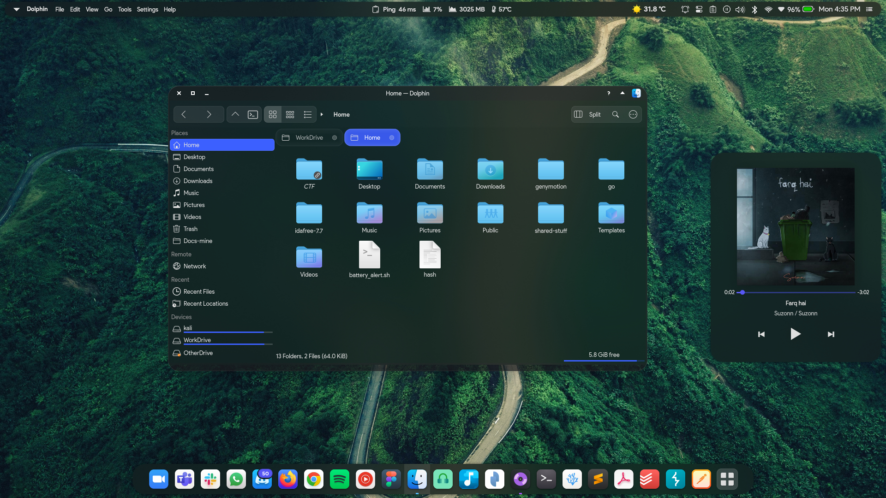
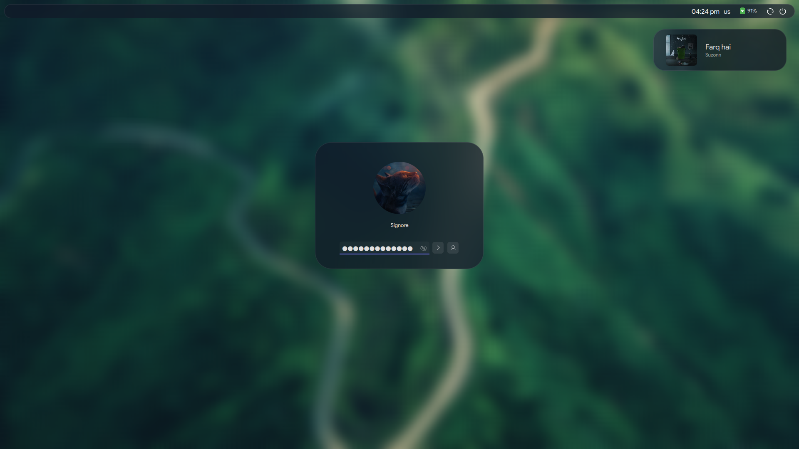

# Glassy

A Glassy theme for KDE

Includes some work from Community Artists.

<!--  -->

## How does it look






## Installation

```shell
git clone https://github.com/the-root-user/Glassy.git
cd Glassy
bash install.sh
```
You will be prompted to select if you want to apply the theme.
Yes, simple as that.

Enjoy!
